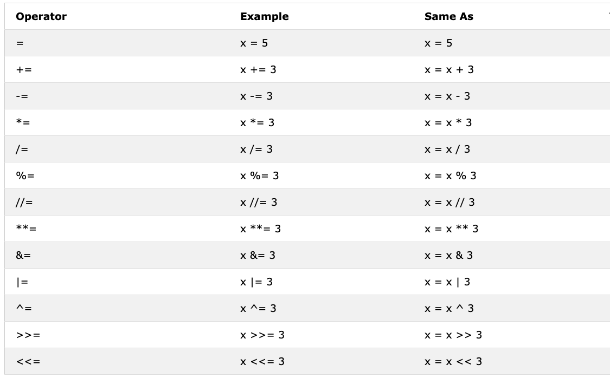
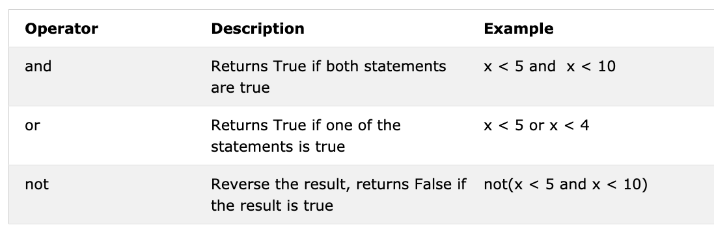

# _Operators_

Python language supports several types of operators. In this section, we will focus on few of them.

## Index

- [Assignment operators](#assignment-operators)
- [Arithmetic operators](#arithmetic-operators)
- [Types of numbers](#types-of-numbers)
  - [Integers](#integers)
  - [Floats](#floats)
  - [Complex numbers](#complex-numbers)
- [Comparison operators](#comparison-operators)
- [Logical operators](#logical-operators)

## Assignment operators

Assignment operators are used to assign values to variables. Let us take = as an example. Equal sign in mathematics shows that two values are equal, however in Python it means we are storing a value in a certain variable and we call it assignment or a assigning value to a variable.



## Arithmetic operators

Arithmetic operators are used to perform mathematical operations on numbers. These operators are essential in programming as they allow you to manipulate and process numerical data.


## Types of numbers

#### Integers

```py
# Arithmetic Operations in Python
# Integers

print('Addition: ', 1 + 2) # 3
print('Subtraction: ', 2 - 1) # 1
print('Multiplication: ', 2 * 3) # 6
print ('Division: ', 4 / 2) # 2.0  Division in Python gives floating number
print('Division: ', 6 / 2) # 3.0
print('Division: ', 7 / 2) # 3.5
print('Division without the remainder: ', 7 // 2) # 3,  gives without the floating number or without the remaining
print ('Division without the remainder: ',7 // 3) # 2
print('Modulus: ', 3 % 2) # 1, Gives the remainder
print('Exponentiation: ', 2 ** 3) # 9 it means 2 * 2 * 2
```

#### Floats

```py
# Floating numbers
print('Floating Point Number, PI', 3.14)
print('Floating Point Number, gravity', 9.81)
```

#### Complex numbers

```py
# Complex numbers
print('Complex number: ', 1 + 1j)
print('Multiplying complex numbers: ',(1 + 1j) * (1 - 1j))
```

Let's declare a variable and assign a number data type. I am going to use single character variable but remember do not develop a habit of declaring such types of variables. Variable names should be all the time mnemonic.

**Example:**

```python
# Declaring the variable at the top first

a = 3 # a is a variable name and 3 is an integer data type
b = 2 # b is a variable name and 3 is an integer data type

# Arithmetic operations and assigning the result to a variable
total = a + b
diff = a - b
product = a * b
division = a / b
remainder = a % b
floor_division = a // b
exponential = a ** b

# I should have used sum instead of total but sum is a built-in function - try to avoid overriding built-in functions
print(total) # If you do not label your print with some string, you never know where the result is coming from
print('a + b = ', total)
print('a - b = ', diff)
print('a * b = ', product)
print('a / b = ', division)
print('a % b = ', remainder)
print('a // b = ', floor_division)
print('a ** b = ', exponentiation)
```

**Example:**

```py
print('== Addition, Subtraction, Multiplication, Division, Modulus ==')

# Declaring values and organizing them together
num_one = 3
num_two = 4

# Arithmetic operations
total = num_one + num_two
diff = num_two - num_one
product = num_one * num_two
div = num_two / num_one
remainder = num_two % num_one

# Printing values with label
print('total: ', total)
print('difference: ', diff)
print('product: ', product)
print('division: ', div)
print('remainder: ', remainder)
```

Let us start start connecting the dots and start making use of what we already know to calculate (area, volume,density, weight, perimeter, distance, force).

**Example:**

```py
# Calculating area of a circle
radius = 10 # Radius of a circle
area_of_circle = 3.14 * radius ** 2 # Two * sign means exponent or power
print('Area of a circle:', area_of_circle)

# Calculating area of a rectangle
length = 10
width = 20
area_of_rectangle = length * width
print('Area of rectangle:', area_of_rectangle)

# Calculating a weight of an object
mass = 75
gravity = 9.81
weight = mass * gravity
print(weight, 'N') # Adding unit to the weight

# Calculate the density of a liquid
mass = 75 # In kg
volume = 0.075 # In cubic meter
density = mass / volume # 1000 Kg/m^3
```

## Comparison operators

Comparison operators are used to compare different values to each other. These operators return a boolean value, either True or False, indicating whether the comparison is true or not. They are used to compare the values of two operands (elements being compared) and are commonly used in conditional statements.


**Example:**

```py
print(3 > 2) # True, because 3 is greater than 2
print(3 >= 2) # True, because 3 is greater than 2
print(3 < 2) # False,  because 3 is greater than 2
print(2 < 3) # True, because 2 is less than 3
print(2 <= 3) # True, because 2 is less than 3
print(3 == 2) # False, because 3 is not equal to 2
print(3 != 2) # True, because 3 is not equal to 2
print(len('mango') == len('avocado')) # False
print(len('mango') != len('avocado')) # True
print(len('mango') < len('avocado')) # True
print(len('milk') != len('meat')) # False
print(len('milk') == len('meat')) # True
print(len('tomato') == len('potato')) # True
print(len('python') > len('dragon')) # False

# Comparing something gives either a True or False

print('True == True: ', True == True)
print('True == False: ', True == False)
print('False == False:', False == False)
```

In addition to the above comparison operator Python uses:

- _is_: Returns true if both variables are the same object(x is y)
- _is not_: Returns true if both variables are not the same object(x is not y)
- _in_: Returns True if the queried list contains a certain item(x in y)
- _not in_: Returns True if the queried list doesn't have a certain item(x in y)

```py
print('1 is 1', 1 is 1) # True - because the data values are the same
print('1 is not 2', 1 is not 2) # True - because 1 is not 2
print('A in Adam', 'A' in 'Adam') # True - a found in the string
print('B in Adam', 'B' in 'Adam') # False - there is no uppercase B
print('coding' in 'coding for all') # True - because coding for all has the word coding
print('a in an:', 'a' in 'an') # True
print('4 is 2 ** 2:', 4 is 2 ** 2) # True
```

## Logical operators

Logical operators are used to combine conditional statements. They return a boolean value, either True or False, indicating whether the condition is true or not. These operators are commonly used in conditional statements and loops.



**Example:**

```py
print(3 > 2 and 4 > 3) # True - because both statements are true
print(3 > 2 and 4 < 3) # False - because the second statement is false
print(3 < 2 and 4 < 3) # False - because both statements are false
print('True and True: ', True and True)
print(3 > 2 or 4 > 3) # True - because both statements are true
print(3 > 2 or 4 < 3) # True - because one of the statements is true
print(3 < 2 or 4 < 3) # False - because both statements are false
print('True or False:', True or False)
print(not 3 > 2) # False - because 3 > 2 is true, then not True gives False
print(not True) # False - Negation, the not operator turns true to false
print(not False) # True
print(not not True) # True
print(not not False) # False
